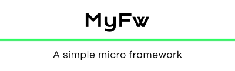

# Indices

* [Introdução](#introdução)
* [Rotas](#rotas)
* * [Rotas com parâmetros](#rotas-com-parâmetros)
* [Controllers](#controllers)
* [Models](#models)
* [Views](#views)


## Introdução

O MyFw é um micro framework simples com *features* básicas como sistema de rotas facilitado e uma template engine simples que ajuda na criação de views.

## Rotas

O sistema de rotas do MyFw é bastante simples e muito semelhante ao de grandes frameworks contemplados como [Slim](https://www.slimframework.com) e [Laravel](https://laravel.com). Todas as rotas são concentradas em um único arquivo chamado de *routes.php* presente na pasta *app/* do sistema.

Na versão atual do MyFw temos quatro métodos para manipulação de rotas, eles são:

```php
$app->get(); //Para requisições GET
$app->post(); //Para requisições POST
$app->put(); //Para requisições PUT
$app->delete(); //Para requisições DELETE
```

Esses métodos recebem dois parâmetros. O primeiro deles é uma *string* contendo a rota a ser registrada, e o segundo pode ser uma *função anônima (Closure)* ou uma *string* com o seguinte padrão *'Controller@action'* que serão executados quando a rota for acessada. A instrução a seguir registra uma rota GET para */* que ao ser acessada executará o método *index* do controller *HomeController*.

```php
$app->get('/', 'HomeController@index');
```

*Obs: Todas as rotas devem ser registradas precedidas de uma **/**.*

## Rotas com parâmetros

O sistema de rotas do MyFw permite que você passe parâmetros para as rotas da seguinte forma:

```php
$app->get('/posts/{id}', 'PostsController@show');
```

Dessa forma ao acessar a rota `https://www.seusite.com/posts/12`, *12* será passado como um parâmetro para o método do controller que será executado. Segue abaixo um exemplo da mesma rota, porém dessa vez usando uma *Closure*.

```php
$app->get('/posts/{id}', function($id) {
    echo "Exibirá o post de id: $id";
});
```

*O funcionamento é o mesmo para os outros tipos de rota.*

## Controllers

Todos os controllers do MyFw ficam dentro de app/controllers. Não há nenhuma especifição para seguir com relação aos controllers, isso fica a cargo do programador.

## Models

No MyFw os models da aplicação ficam em app/models, e devem extender da classe Model. Os models do MyFw contam com alguns métodos iniciais(simples) e com dois atributos essenciais para a execução correta dos mesmos. São eles:

* ***string* $table - **Guarda o nome da tabela que o model irá cuidar.
* ***array* $fillable - **Usado para garantir que somente as colunas presentes nesse array serão manipuladas.
* ***bool* create(*array* $attributes) - **Realiza uma inserção na tabela. Retornando um booleando *true* em caso de sucesso e *false* em caso de falha.
* ***Model* find(int $id) - **Realiza uma busca na tabela por um registro com id = $id. Retorna uma objeto de Model.
* ***array* all() - **Retorna um array com todos os registros da tabela, onde cada indice do array é um objeto de Model.
* ***int* update(*array* $attributes) - ** Atualiza um registro na tabela seguindo o que foi passado em $attributes. O parâmetro deve ser um array onde a chave é o nome da coluna no banco de dados e o valor deve ser o valor a ser preenchido na tabela. Retorna um inteiro com a quantidade de registros atualizados.
* ***int* delete() - **Deleta um registro da tabela.

Os atributos são estáticos e protegidos.  Aqui em baixo temos um exemplo de model.

```php
use MyFw\Model;
class Users extends Model{
    protected static $table = 'users';
    protected static $fillable = ['name', 'username', 'email', 'password'];
}
```

Esse model irá manipular a tabela *users* e só permitirá alterações nas colunas *name, username, email, password*. Abaixo um exemplo de utilização.

```php
$user = Users::find(1); //Busca o usuário de id 1
$user->update(['email' => 'user@email.com']); //Atualiza o campo email
$user->delete(); //Deleta o registro da tabela
```

As propriedades podem ser acessadas como atributo do objeto referenciado por $user. Por exemplo o valor do campo *username* pode ser acessado através de *$user->username*.

## Views

O MyFw conta com uma template engine simples que facilita a criação de views. Todas as views ficam dentro de app/views e devem ter a extensão .phtml. Abaixo um exemplo dos comandos implementados inicialmente:

* **{ $varname = value }**
* **{$varname}**
* **{$varname++} | {$varname--}**
* **{$varname.0} | {$varname.index}**
* **{$varname->property}**
* **@if (condition)**
* **@elseif (condition)**
* **@else**
* **@for(expr1; expr2; expr3)**
* **@foreach($iterable as $item)**
* **@foreach($iterable as $key => $value)**
* **@while(condition)**
* **@end(if|foreach|for|while)**
* **@extends('layout')**
* **@section ('name')**
* **@endsection**

A template engine do MyFw permite que uma view extenda de outra através da diretiva *@extends('name')*.(Todos os layouts ficam dentro de app/views/layout).

Dentro das views você deve especificar secções através da diretiva *@section('name')* para serem construídas na view pai. Na view pai você deve especificar onde cada secção será construída através da diretiva @yield('name'), onde *name* deve ser o mesmo definido através de @section.